<!---

--->

## Hi, 👋 I'm GAO ZHENG(gaozheng2001)

    
<!--

  

-->

  

  

  

    

  

    
  <strong>Check out my work below!</strong>
    
  
  
  
  
  

### Platform

### IDE/EDA

### Language
#### Using

#### Used

#### Learning

### Tools

<!--
**gaozheng2001/gaozheng2001** is a ✨ _special_ ✨ repository because its `README.md` (this file) appears on your GitHub profile.

Here are some ideas to get you started:

- 🔭 I’m currently working on ...
- 🌱 I’m currently learning ...
- 👯 I’m looking to collaborate on ...
- 🤔 I’m looking for help with ...
- 💬 Ask me about ...
- 📫 How to reach me: ...
- 😄 Pronouns: ...
- ⚡ Fun fact: ...
-->
